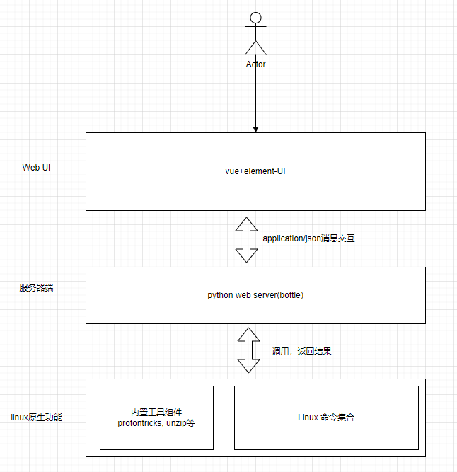
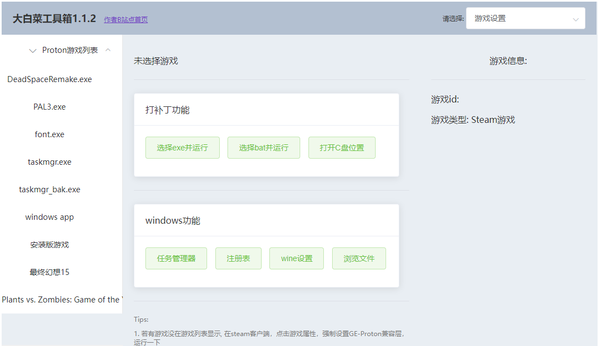
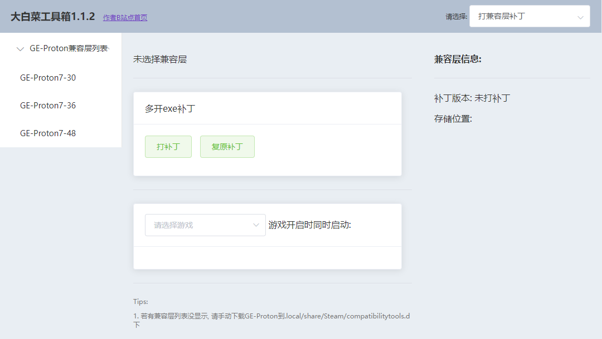
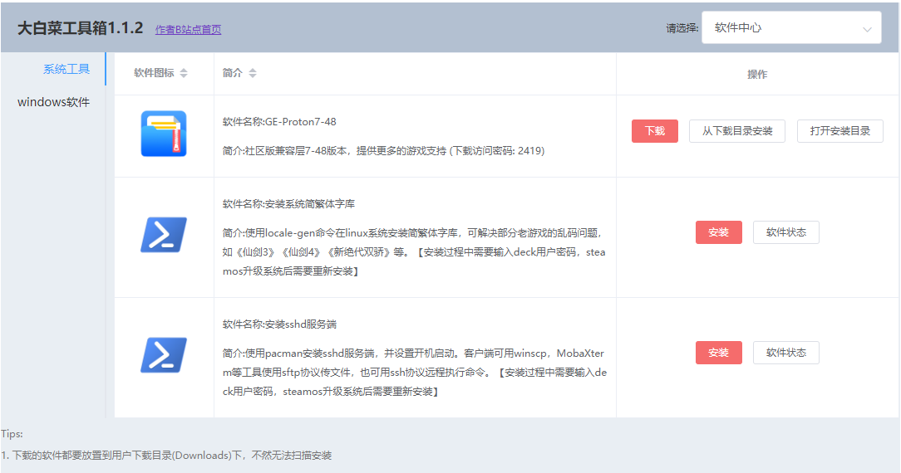

# cabbage-toolkit

#### 介绍
这个一个主要在steamdeck上使用的工具集合，该软件封装了protontricks使用与GE-Proton打exe补丁的工具集合软件，提供友好，汉化的用户界面

#### 软件架构
1. 软件界面使用vue+element-UI开发;

2. 服务器端运行steamdeck上，使用了python轻量级单线程web服务器bottle;

3. 以新开进程的方式调用了python3启动的protontricks;(GPLv3).





#### 安装教程

1.  在konsole等终端应用中执行以下代码
```bash
curl -s https://gitee.com/cabbage-v50-steamdeck/cabbage-toolkit/raw/master/install/cmdline_installer.sh | bash
```
之后会创建一个大白菜工具箱的桌面应用


#### 功能介绍

1.  给游戏打补丁，windows的常用功能
2.  给兼容层打多开exe补丁。
3.  软件中心(兼容层下载，常用工具，windows软件)











#### 参与贡献

1.  Fork 本仓库
2.  新建 Feat_xxx 分支
3.  提交代码
4.  新建 Pull Request

